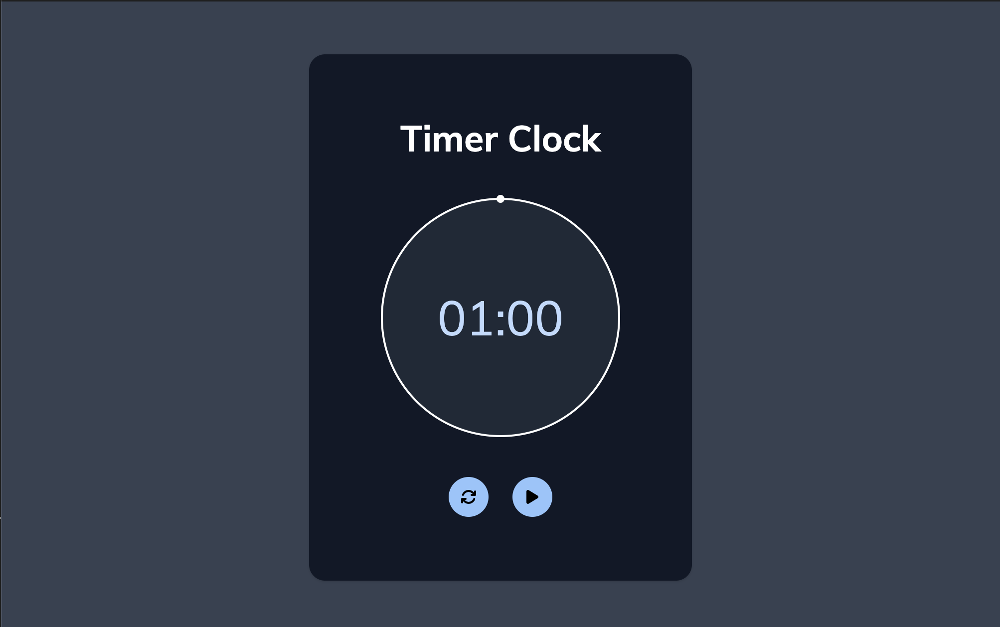

# Timer Clock ⏰



A visually appealing and functional timer application built with HTML, CSS, and JavaScript. This project features an interactive countdown timer with a dynamic circular progress indicator, making it both intuitive and engaging to use.

## Key Features
- **Countdown Timer**: Displays the remaining time in a `MM:SS` format.
- **Interactive Controls**: Start, pause, and reset the timer with a single click.
- **Dynamic Circular Progress**: A conic gradient visually represents the countdown, updating in real time.
- **Responsive Design**: Fully optimized for all screen sizes, from desktops to mobile devices.

## Technologies Used
- **Frontend**: HTML, Tailwind and CSS (with conic gradient and custom animations).
- **JavaScript**: Handles timer logic, dynamic updates, and user interactions.

## How to Run
1. Clone the repository:
   ```bash
   git clone https://github.com/yourusername/Timer-Clock.git
   cd Timer-Clock
   ```
2. Open `index.html` in your browser to use the timer.

## Live Demo
Check out the [Live Demo here:](https://chrisroland.github.io/Timer-Clock/)

## Future Enhancements
- Add customization options for the timer duration.
- Include sound alerts when the timer finishes.
- Add themes for the timer, such as dark mode or colorful progress indicators.

## Contributions
- Feel free to **open issues** for any bugs or feature suggestions.
- **Pull requests** are welcome for enhancements or new features.
- This project is **open-sourced**, and I appreciate **constructive feedback** and **collaborations**!

Thank you for exploring this project! ❤️